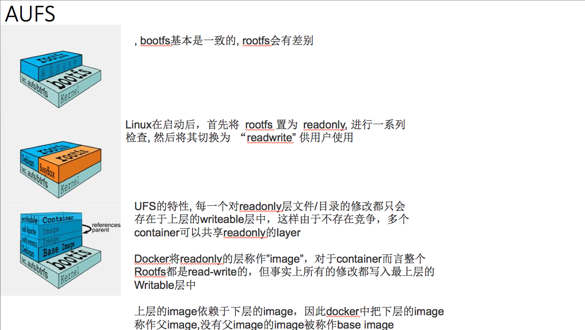

## Docker 分层存储(AUFS)

> 存储驱动根据操作系统底层的支持提供了针对某种文件系统的初始化操作以及对镜像层的增、删、改、查和差异化比较等操作。目前存储系统的接口已经有aufs、btrfs、device mapper、vfs、overlay这5种具体实现，其中vfs不支持写时复制，是为使用volume(Docker提供的文件管理方式)提供的存储驱动，仅仅做了简单的文件挂载操作，剩下4种存储驱动支持定时复制。

> 在启动Docker服务时使用docker -d -s some_driver_name来指定使用的存储驱动，当然指定的驱动必须被底层操作系统支持。

> AUFS作为Docker典型存储驱动，我们来初探一下。

> AUFS是一种支持联合挂载的文件系统，简单来说就是支持将不同目录挂载到同个目录下，这些挂载操作对用户来说是透明的，用户在操作该目录时并不会觉得与其他目录有什么不同。这些目录的挂载是分层的，通常来说最上层是可读下层，下层是只读层。所以, aufs的每一层都是一个普通文件系统。

> 当需要读取一个文件A时，会从顶层的读写层开始向下寻找，本层没有，则根据层之间的关系到下一层开始找，直到找到第一个文件A并打开它。

> 当需要写入一个文件A时，如果这个文件不存在，则在读写层新建一个；否则像上面的过程一样从顶层开始查找，直到找到最近的文件A,aufs会把这个文件复制到读写层进行修改。由此可以看出，在第一次修改某个已有文件时，如果这个文件很大，即使只要修改几个字节，也会产生巨大的磁盘开销。

> 当需要删除一个文件时，如果这个文件仅仅存在于读写层中， 则可以直接删除这个文件；否则就需要先删除它在读写层中的备份，再在读写层中创建一个without文件来标志这个文件不存在，而不是真正删除底层的文件 。

> 当新建一个文件时，如果这个文件在读写存在对应的without文件，则先将without文件删除再创建。否则直接在读写层新建即可。

- 典型的Linux启动到运行需要两个FS: bootfs和rootfs

> bootfs (boot file system) 主要包含 bootloader 和 kernel, bootloader主要是引导加载kernel, 当boot成功后 kernel 被加载到内存中后 bootfs就被umount了.

> rootfs (root file system) 包含的就是典型 Linux 系统中的 /dev, /proc, /bin, /etc 等标准目录和文件。

> 由此可见对于不同的linux发行版, bootfs基本是一致的, rootfs会有差别, 因此不同的发行版可以公用bootfs 典型的Linux在启动后，首先将 rootfs 置为 readonly, 进行一系列检查, 然后将其切换为 “readwrite” 供用户使用。在docker中，起初也是将 rootfs 以readonly方式加载并检查，然而接下来利用 union mount 的将一个 readwrite 文件系统挂载在 readonly 的rootfs之上，并且允许再次将下层的 file system设定为readonly 并且向上叠加, 这样一组readonly和一个writeable的结构构成一个container的运行目录, 每一个被称作一个Layer。

- AUFS好处
    - 节省存储空间 - 多个container可以共享base image存储
    - 快速部署 - 如果要部署多个container，base image可以避免多次拷贝
    - 内存更省 - 因为多个container共享base image, 以及OS的disk缓存机制，多个container中的进程命中缓存内容的几率大大增加
    - 升级更方便 - 相比于 copy-on-write 类型的FS，base-image也是可以挂载为可writeable的，可以通过更新baseimage而一次性更新其之上的container
    - 允许在不更改base-image的同时修改其目录中的文件 - 所有写操作都发生在最上层的writeable层中，这样可以大大增加base image能共享的文件内容。

