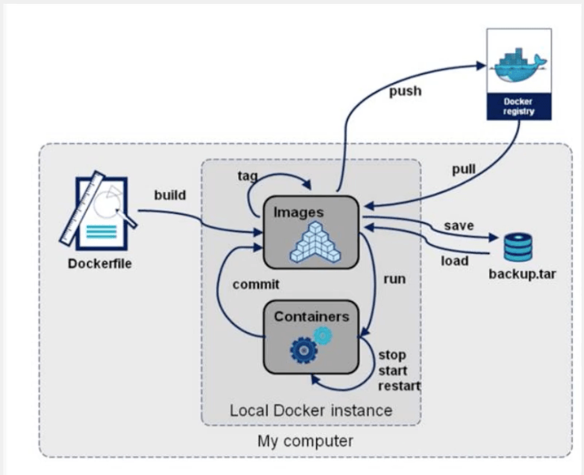
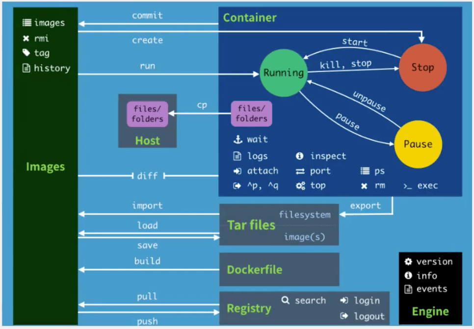

> 命令	作用
- attach     
 当前 shell 下 attach 连接指定运行镜像 

- build	     
 通过 Dockerfile 定制镜像 

- commit	 
 提交当前容器为新的镜像 

- cp	     
 从容器中拷贝文件或目录到宿主机中 

- create	 
 创建一个新的容器，同时 run，但不启动 

- diff	     
 查看 docker 容器变化 

- events	 
 从 docker 服务获取容器实时事件 

- exec	     
 在已存在的容器上运行命令 

- export	 
 导出容器的内容流作为一个 tar 归档文件 [对应 import] 

- history	 
 从 tar 包中的内容创建一个新的文件系统镜像 [对应 export] 

- images	 
 列出系统当前镜像 

- import	 
 从 tar 包中的内容创建一个新的文件系统镜像 

- info	     
 显示系统相关信息 

- inspect	 
 查看容器详细信息 

- kill	     
 kill 指定 docker 容器 

- load	     
 从一个 tar 包中加载一个镜像 [对应 save] 

- login	     
 注册或者登陆一个 docker 源服务器 

- logout	 
 从当前 Docker registry 退出 

- logs	     
 输出当前容器日志信息 

- port	     
 查看映射端口对应的容器内部源端口 

- pause	     
 暂停容器 

- ps	     
 列出容器列表 

- pull	     
 从 docker 镜像源服务器拉取指定镜像或者库镜像 

- push	     
 推送指定镜像至 docker 源服务器 

- restart	 
 重启运行的容器 

- rm	     
 移除一个或者多个容器 

- rmi	     
 移除一个或多个镜像 [无容器使用该镜像才可删除，否则需删除相关容器才可继续或 -f 强制删除] 

- run	     
 创建一个新的容器并运行一个命令 

- save	     
 保存一个镜像为一个 tar 包对应 [load] 

- search	 
 在 docker hub 中搜索镜像 

- start	     
 启动容器 

- stop	     
 停止容器 

- tag	     
 给源中镜像打标签 

- top	     
 查看容器中运行的进程信息 

- unpause	 
 取消暂停容器 

- version	 
 查看 docker 版本号 

- wait	     
 截取容器停止时的退出状态 

